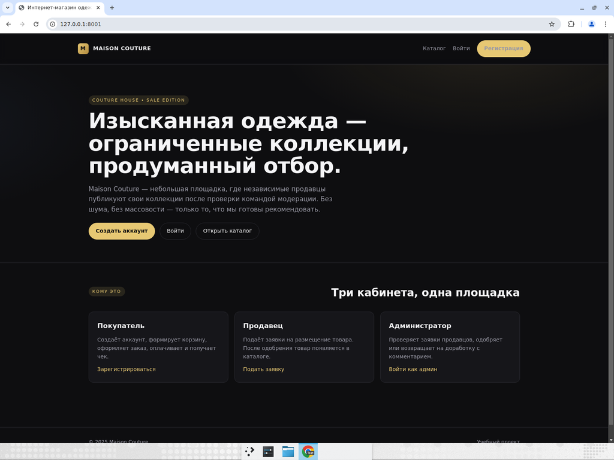
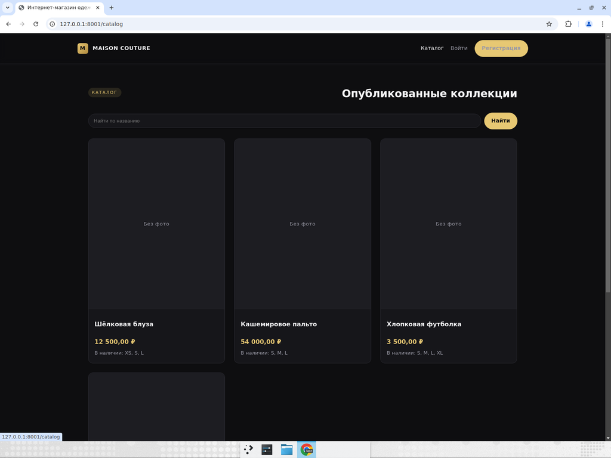
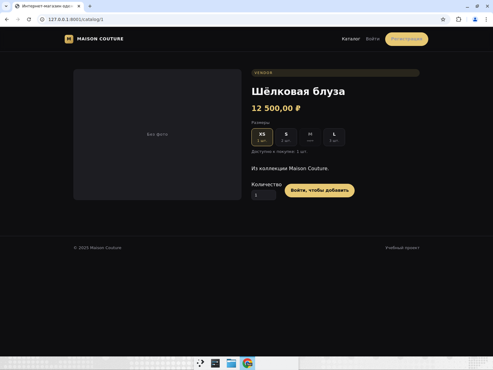
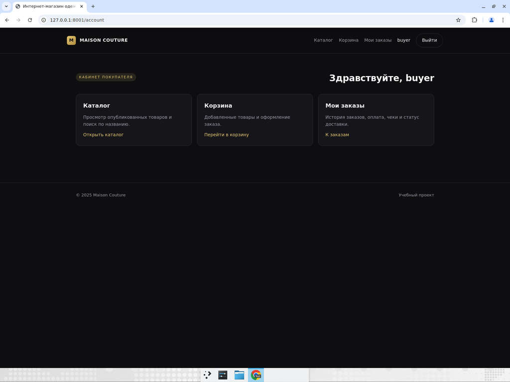
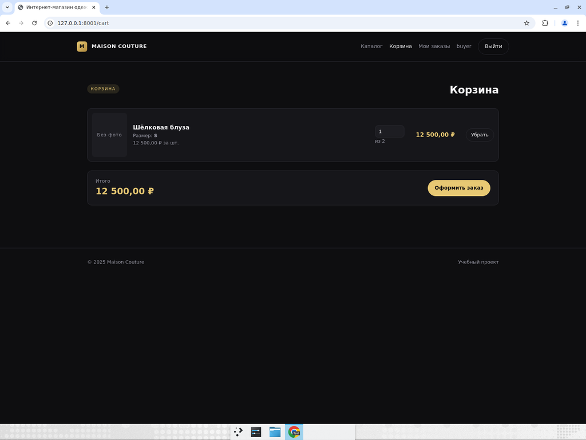
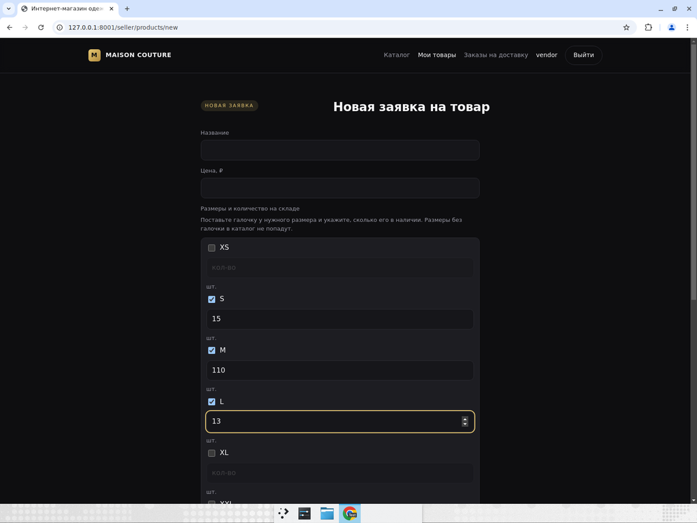
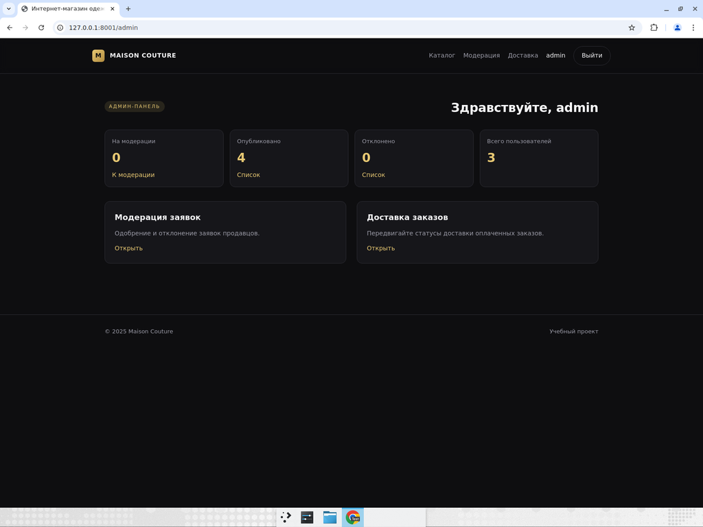
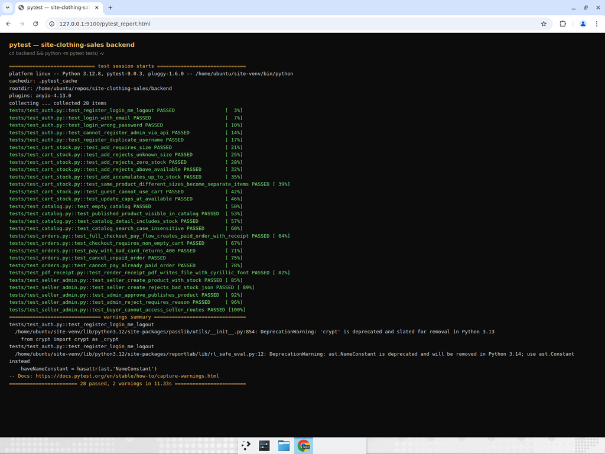

# Maison Couture — интернет-магазин одежды

Учебный проект: разделён на **backend (FastAPI, JSON-API)** и
**frontend (React + TypeScript, SPA)**. Авторизация — сессионная (cookie).
По умолчанию используется **SQLite** для удобства запуска; легко
переключается на **PostgreSQL** через `DATABASE_URL`.

## Что реализовано

- Регистрация и вход для трёх ролей (`buyer`, `seller`, `admin`).
  Админ создаётся через CLI-скрипт.
- Публичный каталог опубликованных товаров с поиском по
  названию (регистронезависимый, работает с кириллицей) и корзина
  покупателя (добавить, изменить количество, удалить).
- Учёт остатков по каждому размеру: продавец отмечает галочкой
  доступные размеры и указывает количество. При добавлении в корзину
  и оформлении заказа сервер валидирует размер и запас.
- Оформление заказа со снапшотом товаров, валидацией адреса
  и очисткой корзины.
- Имитация оплаты + PDF-чек (`receipt_number`,
  `transaction_id`, `pdf_url`), кириллица в чеке рендерится шрифтом
  DejaVu; скачивание защищено ACL (владелец или админ).
- Статусы доставки `processing → shipped → in_transit →
  delivered`. Меняют вперёд админ (любой оплаченный заказ) и продавец
  (только заказы со своими товарами). Покупатель видит трекер на
  странице заказа.
- Добавление товара продавцом (multipart-загрузка фото,
  валидация имени, цены, размеров с количеством, описания),
  редактирование и удаление заявки, пока она в статусе `pending`.
- Модерация заявок администратором (одобрение / отказ с
  обязательной причиной).

## Скриншоты

| | |
| --- | --- |
|  Главная |  Каталог с признаком остатков |
|  Карточка: выбор размера, под каждым — остаток |  Кабинет покупателя после логина |
|  Корзина с привязкой к размеру и лимитом |  Форма продавца: чекбокс + количество для каждого размера |
|  Админ-панель |  `pytest` — 28 passed |

## Тесты

Бэкенд покрыт компактным `pytest`-набором, который гоняется без
Docker — он поднимает изолированную SQLite в `tempfile` через переменные
окружения и использует `fastapi.testclient.TestClient`:

```powershell
cd backend
python -m venv .venv
.\.venv\Scripts\Activate.ps1   # macOS/Linux: source .venv/bin/activate
pip install -r requirements-dev.txt
python -m pytest tests/ -v
```

Что покрыто (`backend/tests/`):

- `test_auth.py` — регистрация, логин (по логину и по email), `/me`,
  логаут, защита от регистрации админа через API, дубликат логина.
- `test_catalog.py` — пустой каталог, выдача опубликованных товаров,
  включение `stock` в ответ, регистронезависимый поиск по кириллице.
- `test_cart_stock.py` — ключевые сценарии валидации остатков:
  обязательный размер, неизвестный размер, нулевой запас, превышение
  доступного, накопление в один лот, разные размеры → разные строки
  корзины, гость не может работать с корзиной, апдейт количества
  упирается в запас.
- `test_orders.py` — чекаут с корректным телом, переход в `paid`
  с PDF-чеком, пустая корзина → 400, плохая карта → 400, отмена
  неоплаченного заказа, повторная оплата → 409.
- `test_seller_admin.py` — создание товара продавцом с `stock`-JSON,
  валидация формата stock, одобрение/отклонение админом, появление
  товара в публичном каталоге после approve, защита `/api/seller/*`
  от покупателя.
- `test_pdf_receipt.py` — PDF-чек содержит реально встроенный шрифт
  DejaVu (защищает от регрессии «кириллица в чеке как чёрные квадраты»).

## Структура репозитория

```
backend/                       # FastAPI: только JSON API + раздача SPA
├── app/
│   ├── main.py                # включает /api/* роутеры и SPA-fallback
│   ├── config.py              # настройки + uploads_dir, receipts_dir
│   ├── database.py            # engine + SessionLocal + init_db
│   ├── models.py              # User, Product, CartItem, Order, OrderItem, Receipt
│   ├── schemas.py             # Pydantic DTO для API
│   ├── security.py            # passlib/bcrypt
│   ├── dependencies.py        # get_current_user (по сессии)
│   ├── routers/api/
│   │   ├── auth.py            # /api/auth/{register,login,logout,me}
│   │   ├── catalog.py         # /api/catalog
│   │   ├── cart.py            # /api/cart
│   │   ├── orders.py          # /api/orders + /receipts/{file}
│   │   ├── seller.py          # /api/seller/*
│   │   └── admin.py           # /api/admin/*
│   └── services/
│       ├── delivery.py        # переходы статусов доставки
│       └── receipts.py        # PDF чека (reportlab)
├── scripts/create_admin.py
├── uploads/                   # фото товаров (раздаётся через /uploads)
├── receipts/                  # PDF-чеки (раздаётся через /receipts ACL)
└── requirements.txt

frontend/                      # Vite + React + TypeScript SPA
├── src/
│   ├── main.tsx, App.tsx
│   ├── auth.tsx               # AuthContext, useAuth
│   ├── api.ts                 # fetch-обёртка с обработкой ошибок
│   ├── types.ts               # mirror of backend/app/schemas.py
│   ├── components/            # Layout, RequireRole, DeliveryTrack, …
│   └── pages/                 # public, buyer, seller, admin
├── vite.config.ts             # dev-прокси /api, /uploads, /receipts → :8000
├── package.json
└── tsconfig.json
```

## Запуск через Docker Compose (быстрый путь)

Подходит, если нужно поднять всё одной командой и не возиться с
Python/Node локально. Требуется только Docker Desktop (Windows/macOS) или
Docker Engine + `docker compose` (Linux).

```powershell
cd path\to\site-clothing-sales

# 1) Создать .env из примера (можно отредактировать порт/секрет)
copy .env.example .env

# 2) Поднять backend + frontend
docker compose up -d --build

# 3) Создать администратора (один раз; пароль поменяйте)
docker compose exec backend `
  python -m scripts.create_admin --username admin --email admin@example.com --password "changeme123"
```

Откройте **http://127.0.0.1:8080** — это nginx, который раздаёт SPA и
проксирует `/api`, `/uploads`, `/receipts` на FastAPI. Порт настраивается
в `.env` через `FRONTEND_PORT`.

Полезные команды:

```powershell
docker compose ps                 # статус контейнеров
docker compose logs -f backend    # логи бэка
docker compose logs -f frontend   # логи nginx
docker compose restart backend    # рестарт после изменений в .env
docker compose down               # остановить (volumes сохранятся)
docker compose down -v            # остановить и стереть БД/uploads/receipts
docker compose pull && docker compose up -d --build   # обновить образы
```

Файлы и БД лежат в Docker-volumes:
- `backend_data` — SQLite-БД (`clothing_sales.db`).
- `backend_uploads` — фото товаров.
- `backend_receipts` — PDF-чеки.

Чтобы переключиться на PostgreSQL — в `.env` поправьте `DATABASE_URL`,
раскомментируйте `POSTGRES_*` и поднимите профиль:

```powershell
docker compose --profile postgres up -d --build
```

### Как подтянуть из git и переподнять

```powershell
cd path\to\site-clothing-sales
git fetch origin
git checkout main                 # или нужную ветку
git pull
docker compose up -d --build      # пересобрать образы и перезапустить
```

### Откат, если что-то сломалось

1. **Просто вернуться на main** (если разрабатывали в ветке):
   ```powershell
   docker compose down
   git checkout main
   git pull
   docker compose up -d --build
   ```
2. **Откатить уже мерженный PR** — в GitHub нажать «Revert» на PR
   (создастся обратный PR), либо локально:
   ```powershell
   git checkout main
   git pull
   git revert -m 1 <merge-commit-sha>
   git push origin main
   docker compose up -d --build
   ```
3. **Совсем чистый сброс** (удалит данные):
   ```powershell
   docker compose down -v --rmi all      # стереть контейнеры, volumes и образы
   git checkout main
   git pull
   docker compose up -d --build
   ```
4. **Старая SSR-версия** (до разделения backend/frontend) — это коммит
   `9f1f57a` на `main` (мерж PR #8). Если этот PR ещё не смержен, просто
   `git checkout main` и работайте с прошлой версией:
   ```powershell
   git checkout main
   git pull
   ```
   Если уже смержен и нужно полностью вернуться к SSR — сделайте «Revert»
   через GitHub-UI. Силой ресетить master на старый коммит можно, но
   только если вы уверены, что никто другой не зависит от истории.

## Запуск без Docker (Windows / PowerShell)

> На macOS/Linux замените `python` → `python3` и используйте
> `source .venv/bin/activate` вместо `.\.venv\Scripts\Activate.ps1`.

### 1. Подтянуть код

```powershell
cd path\to\site-clothing-sales
git checkout main             # или любую другую ветку
git pull origin main
```

### 2. Backend

```powershell
cd backend
python -m venv .venv
.\.venv\Scripts\Activate.ps1

pip install --upgrade pip
pip install -r requirements.txt

# По желанию пересоздать БД (после изменения схемы)
del clothing_sales.db

# Создать администратора (нужно один раз)
python -m scripts.create_admin --username admin --email admin@example.com --password "changeme123"

uvicorn app.main:app --reload --host 127.0.0.1 --port 8000
```

Backend поднимется на `http://127.0.0.1:8000` и будет отдавать только
JSON-API + статику (`/uploads`, `/receipts`). Если фронт ещё не
собран и обращаются к корню `/`, вернётся 503 с подсказкой.

### 3. Frontend (новый второй терминал)

```powershell
cd path\to\site-clothing-sales\frontend
npm install
npm run dev
```

Vite поднимется на `http://127.0.0.1:5173` и будет проксировать
`/api`, `/uploads`, `/receipts` на backend `:8000`. Открывать
приложение нужно по адресу Vite: <http://127.0.0.1:5173>.


